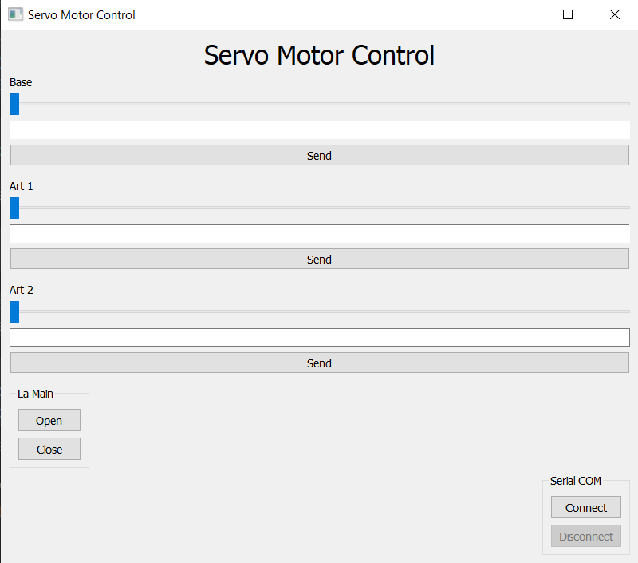

# Servo Motor Control GUI

  
*A simple GUI application to control servo motors using Python and an Arduino.*

## Overview

This project provides a graphical user interface (GUI) to control multiple servo motors connected to an Arduino via serial communication. Built using Python's `PyQt5` library, the application allows users to adjust the position of three servo motors ("Base", "Art 1", and "Art 2") using sliders or by entering specific degree values. Additionally, a fourth servo ("La Main") can be opened or closed with dedicated buttons. The GUI also includes controls to connect and disconnect from the Arduino via a serial COM port.

## Features

- **Servo Control**: Adjust the position of three servo motors (0° to 180°) using sliders or text input.
- **La Main Control**: Open and close a fourth servo with dedicated buttons.
- **Serial Communication**: Connect and disconnect from the Arduino using a specified serial port (default: `COM7`).
- **User-Friendly Interface**: Clean and intuitive GUI built with PyQt5.

## Requirements

To run this project, you need the following:

### Hardware
- An Arduino board (e.g., Arduino Uno)
- Servo motors connected to the Arduino
- USB cable to connect the Arduino to your computer

### Software
- Python 3.x
- PyQt5 (`pip install PyQt5`)
- pyserial (`pip install pyserial`)
- Arduino IDE (to upload the corresponding Arduino code to your board)

## Setup

1. **Clone the Repository**  
